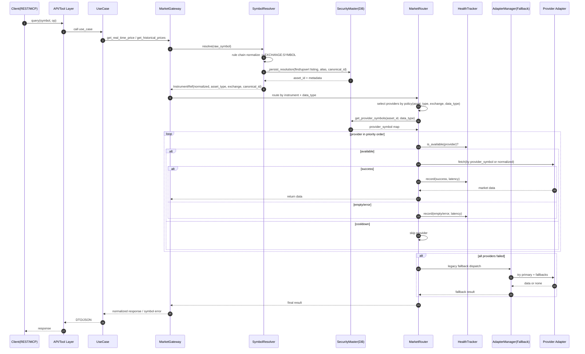

# Request-to-Data Routing Flow

This document captures the end-to-end runtime flow from client request to
provider data fetch in the current stock-mcp architecture.

## Sequence Diagram

## Key Notes

- Symbol normalization and persistence happen before provider routing.
- Routing decision key is `(asset_type, exchange, data_type)`.
- Health tracker can temporarily cooldown unstable providers.
- Legacy adapter fallback is the final resilience layer.
